LAB 1 : Mise en place de l’environnement de test (Mobexler + snapshot propre)
Étape 1 : Vérification du téléchargement de Mobexler

Avant l’importation, l’intégrité du fichier OVA a été contrôlée.
Le hash SHA256 du fichier local a été généré à l’aide de la commande :
Get-FileHash .\Mobexler.ova -Algorithm SHA256

Ce hash a ensuite été comparé à celui fourni sur le site officiel de Mobexler.

 
 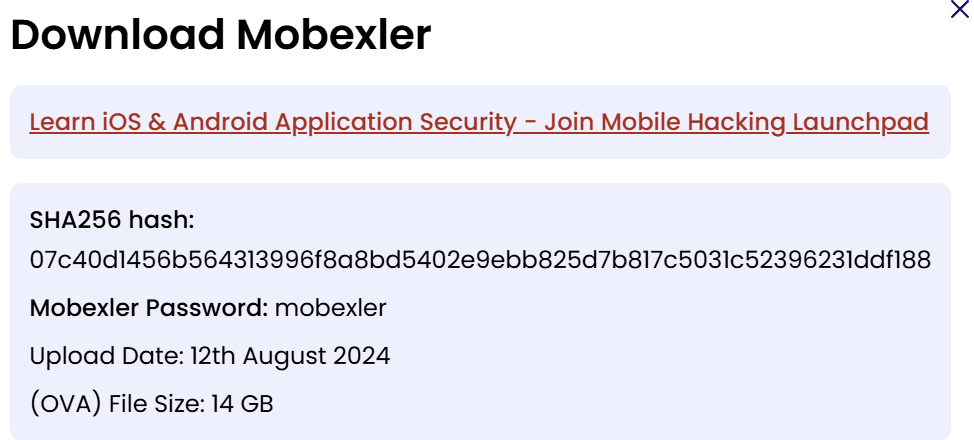 

Les deux empreintes étant identiques, le fichier est complet et non corrompu.

Étape 2 : Importation de Mobexler dans VirtualBox

La machine virtuelle a été importée dans VirtualBox avec succès.

 
 
 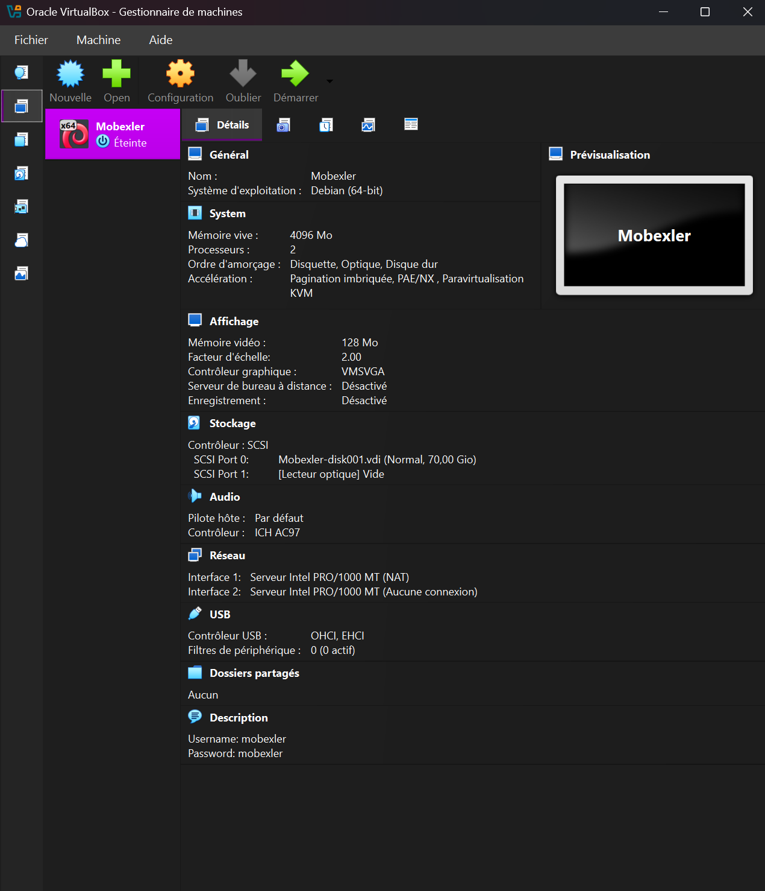 

Après importation, la configuration réseau a été ajustée dans les paramètres de la VM :

 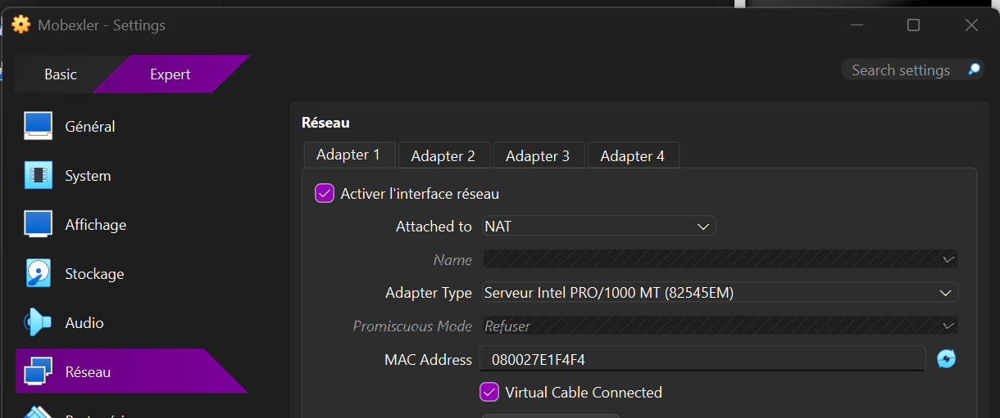 
 
 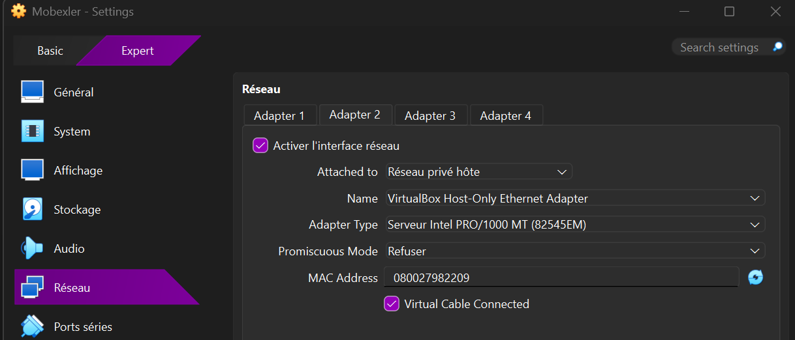 

Étape 3 : Démarrage de la machine et accès initial

La machine virtuelle a été démarrée pour la première fois afin de vérifier son bon fonctionnement.

 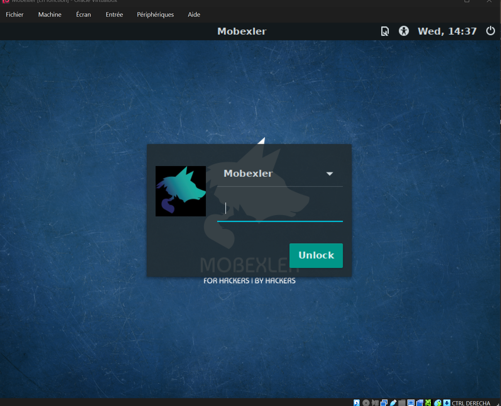 

Accès au terminal de la machine :

 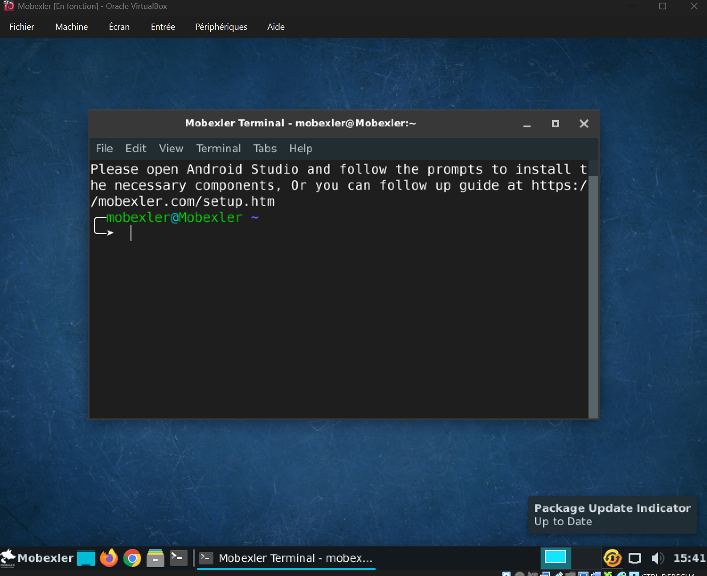 

Étape 4 : Vérification de la configuration réseau
Affichage des interfaces réseau avec la commande ip a :

 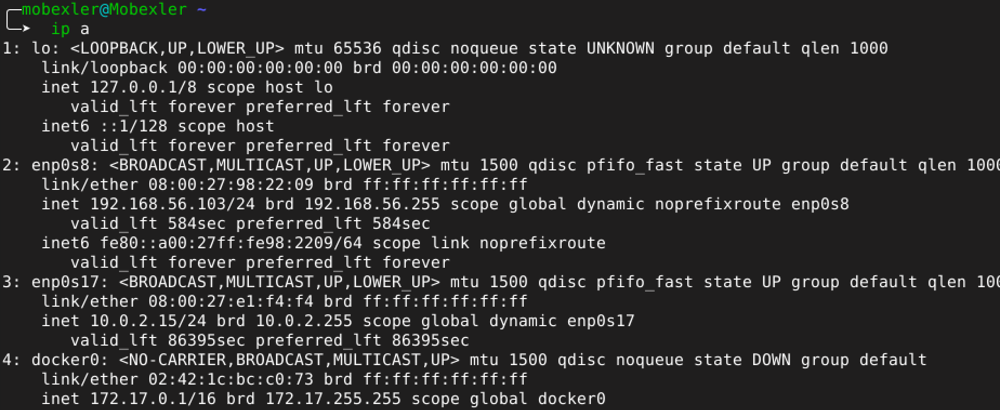 

enp0s17 : 10.0.2.15/24 → NAT (accès Internet via VirtualBox) 
 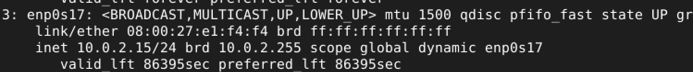 

enp0s8 : 192.168.56.103/24 → Host-Only (communication entre la VM et l’hôte) 
 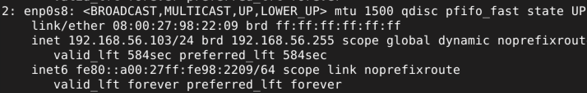 

Vérification des routes réseau avec ip route :

 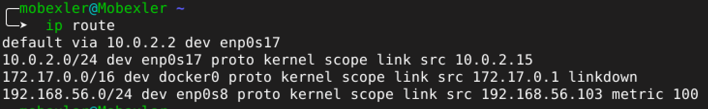 

Test de connectivité Internet :

 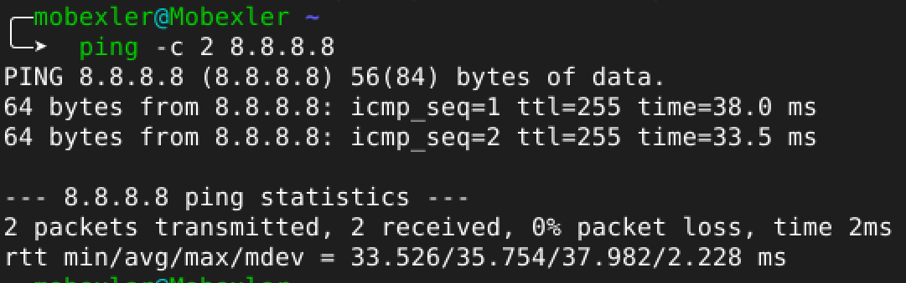 
 
 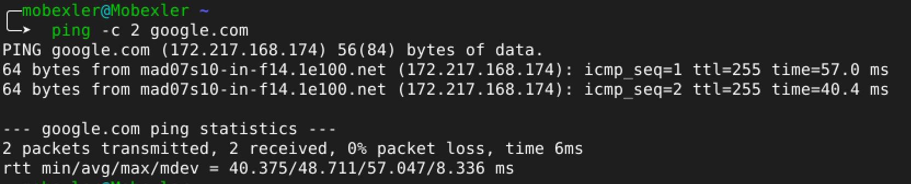 

Étape 5 : Création d’un snapshot

Un snapshot a été créé afin de conserver un état propre de la machine virtuelle avant les tests.

 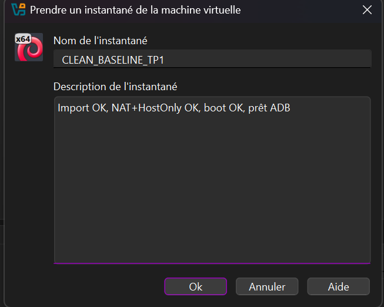 
 
 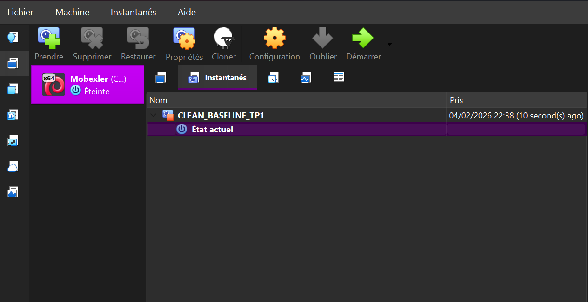 

Étape 6 : Mise en place de l’environnement Android pour les tests
Activation du mode développeur sur le téléphone (7 appuis sur le numéro de build)

 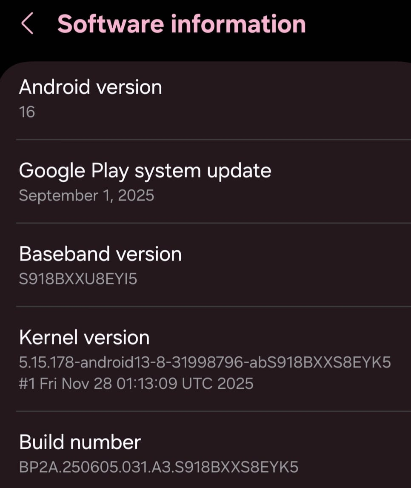 

Activation du débogage USB dans les options développeur

 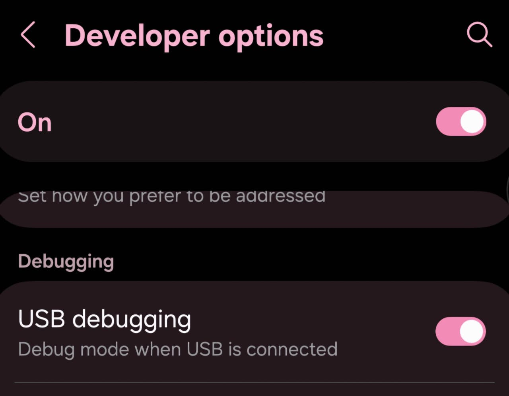 

Connexion du téléphone à la VM via VirtualBox (USB)
Dans les paramètres de la machine virtuelle, ajout du périphérique USB correspondant au téléphone :

 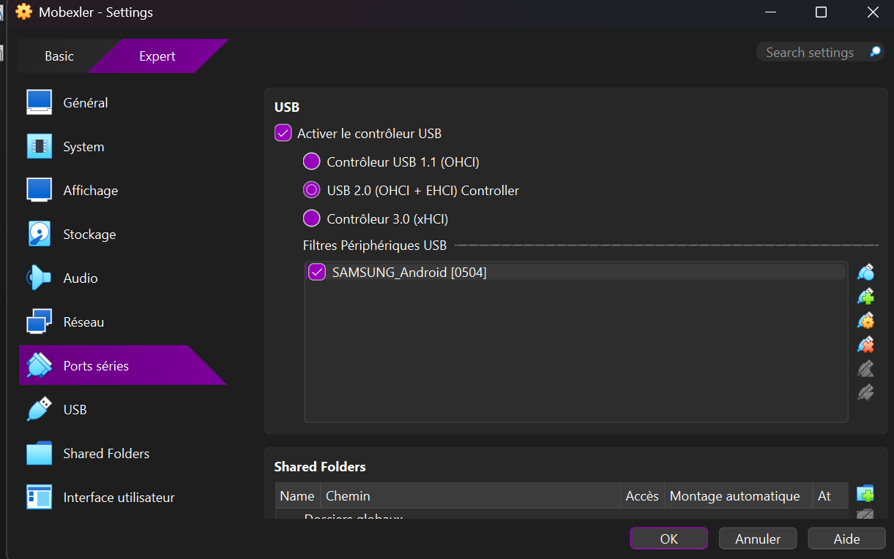 

Vérification d’ADB dans Mobexler :

 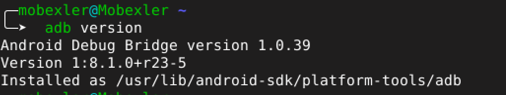 
 
 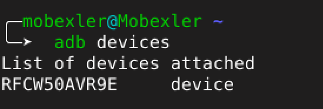 
